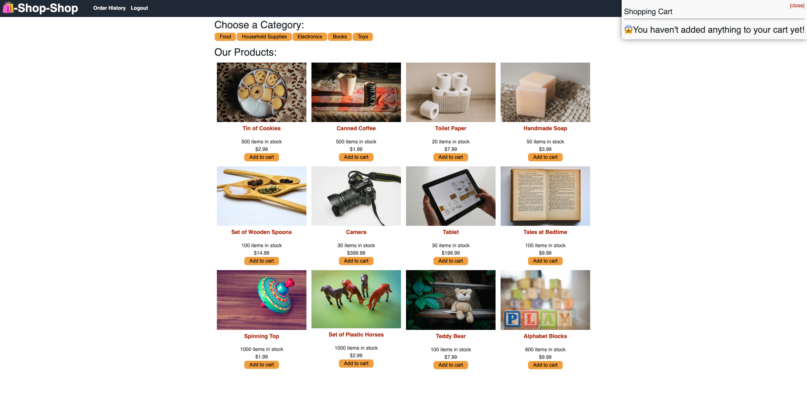
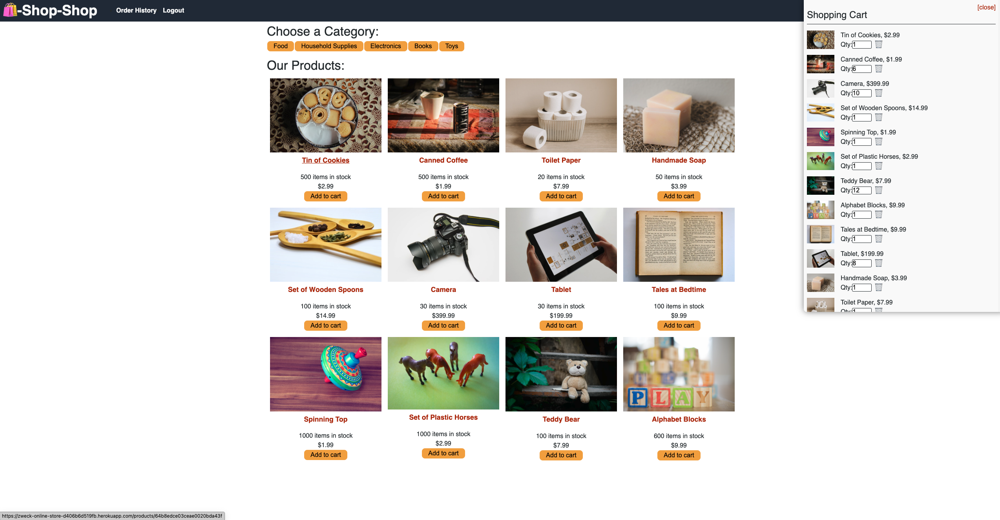
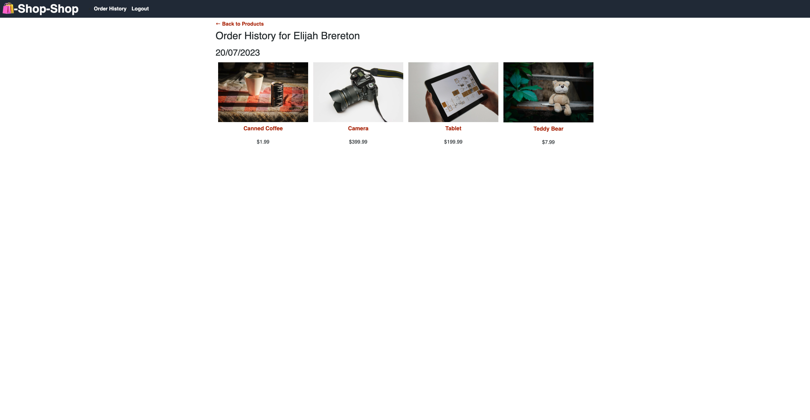

## Redux Online Store Refactor


*An online store utilising Redux and Stripe for an easy shopping experience*

[](https://developer.mozilla.org/en-US/docs/Web/JavaScript)  [](https://developer.mozilla.org/en-US/docs/Web/CSS) [](https://developer.mozilla.org/en-US/docs/Web/HTML)

---

## Packages used
[](https://react.dev/) [](https://nodejs.org/en/) [](https://mongoosejs.com/) [](https://expressjs.com/) [](https://graphql.org) [](https://stripe.com/) [](https://redux.js.org/)

---

## Links
GitHub Repository: [@elibrer](https://github.com/Elibrer/redux-store-refactor)

Link to deployed application: [@Zweck Online Store](https://zweck-online-store-d406b6d519fb.herokuapp.com/)

---

## Contributors
> Elijah Brereton @[GitHub](https://github.com/elibrer)

---

## Table of Contents
- [Description](#description)
- [Installation](#installation)
- [Features](#features)
- [Documentation](#documentation)
- [Application Preview](#application-preview)
- [License](#license)
- [Tests](#tests)
- [Questions](#questions)

---

## Description
An easy to use online store application, allowing users to signup and/or login to an account, choose products which are added to the cart, and complete a sale by using a third party (Stripe) application to process the payment. The site uses Redux to store global state variables, effectively handling the way the cart is updated and manipulated from page to page. 

---

## Installation

For usage of this application, visit the [Zweck Online Store](https://zweck-online-store-d406b6d519fb.herokuapp.com/) website via heroku. No further installation is required to access and operate the web page. 


---

## Features
```md
- GIVEN an e-commerce platform that uses Redux to manage global state
- WHEN I review the app’s store
- THEN I find that the app uses a Redux store instead of the Context API
- WHEN I review the way the React front end accesses the store
- THEN I find that the app uses a Redux provider
- WHEN I review the way the app determines changes to its global state
- THEN I find that the app passes reducers to a Redux store instead of using the Context API
- WHEN I review the way the app extracts state data from the store
- THEN I find that the app uses Redux instead of the Context API
- WHEN I review the way the app dispatches actions
- THEN I find that the app uses Redux instead of the Context API
```

---

## Documentation
No documentation provided.

---

## Application Preview
### `Main page with empty cart`

### `Main page with full cart`

### `Order history page`

### `Signup page`


---

## License
[Licensed under the MIT license.](https://opensource.org/licenses/MIT)

---

## Tests
To test, simply run the application by using the instructions provided above. If there are any errors, or the application did not work in the intended way, please try to locate and log the lines of code that bring up the error, and forward all issues to the email below.

---

## Questions
For questions and enquiries, please contact me at: 
[eli.brer@gmail.com](eli.brer@gmail.com)